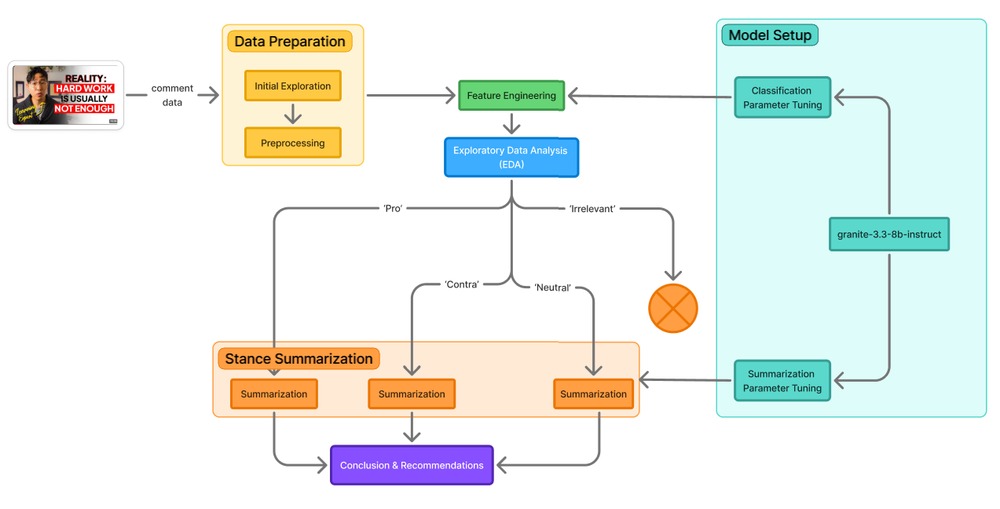
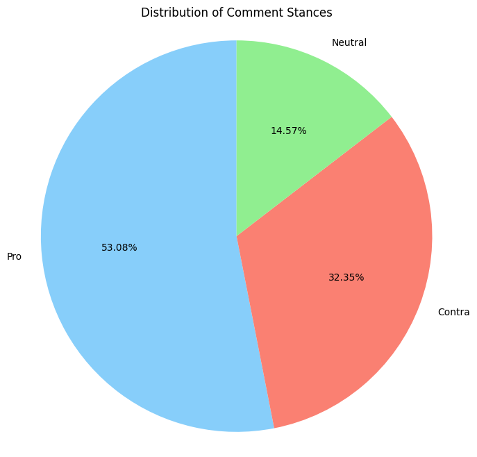
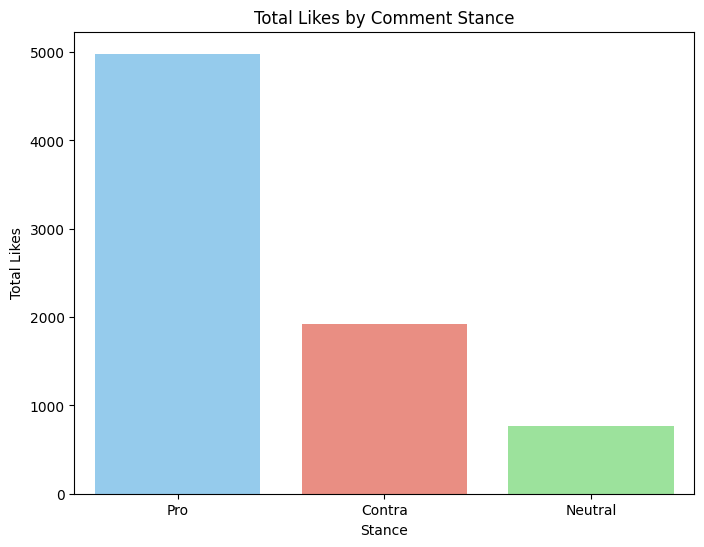
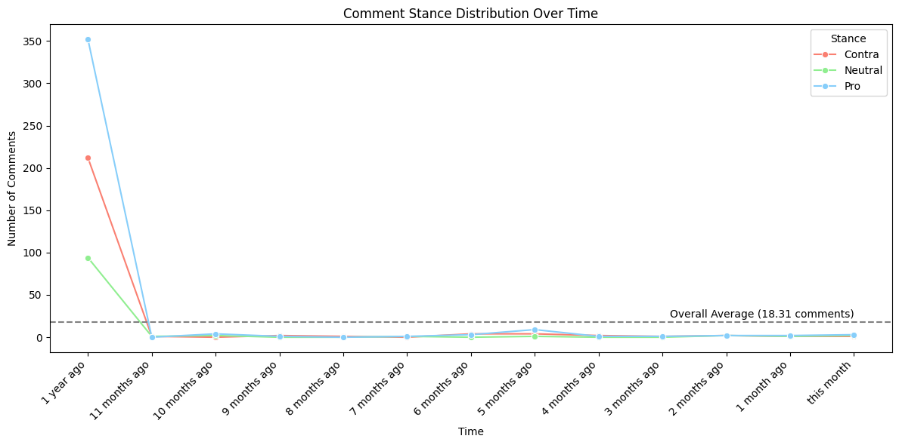
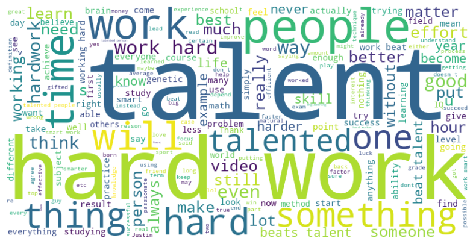

# Hardwork vs Talent: What Does the Public Really Think?

## Project Overview
The question of whether hard work truly beats talent has sparked debate for generations. The issue continues to be relevant, as societal values, personal experiences, and cultural narratives all shape our beliefs about effort and ability.

Knowing this, I plan to investigate these differing viewpoints by analyzing real-world responses. The goal is to summarize each nuanced viewpoints and offer a balanced, evidence-based resolution that acknowledges the complexity of the debate.

The flowchart aboves provides a clear overview of the end-to-end process for analyzing public opinions on the debate “Does hard work beat talent?” based on YouTube comment data. The process begins with data preparation, where comments from a selected video are explored and preprocessed to remove noise, inconsistencies, and irrelevant data. This includes cleaning the likes and time formats, filtering out duplicates, and excluding comments from the video creator to ensure focus on audience perspectives.

Next, feature engineering is performed where comments are categorized into four stance labels: 'Pro', 'Contra', 'Neutral', and 'Irrelevant' with the help of an AI model, granite-3.3-8b-instruct, which I tuned specifically for classification. Exploratory data analysis (EDA) follows to identify patterns in engagement, stance distribution, and comment timing.

Then, each stance category (Pro, Contra, and Neutral) is sent through the stance summarization stage. Comments labeled as 'Irrelevant' are excluded from further analysis to maintain clarity and focus. Here, the same AI model is used where this time fine-tuned for summarization to extract the core arguments and ideas frequently mentioned by commenters in each stance. Finally, all summarized findings are synthesized into a section of conclusions and recommendations, which reflect both the data-driven insight and its practical implications for education, personal growth, and success narratives.

## Raw Dataset Link
https://github.com/RichieDarrian/hardwork-vs-talent/blob/main/raw_dataset.csv

The raw_dataset is the result of scraping the comments from Justin Sung's video called [**4 Reasons Hard Work DOES NOT Beat Talent**](https://www.youtube.com/watch?v=aRHTEhQp1g0).

## Insight & Findings

The pie chart reveals that the majority of comments (52.08%) express a 'Pro' stance, about 32.35% are 'Contra', and 14.56% are 'Neutral'. This distribution reflects that the dominant opinion in the comment section leans toward valuing effort over innate ability. Hence, it should be acknowledged that **the 'Pro' stance will naturally be represented more prominently in the summarization.**

Once again, the chart confirms that the 'Pro' stance not only dominates in quantity but also receives significantly more audience approval, as reflected by the total number of likes. This reinforces the earlier point that **any summarization will naturally be skewed toward the 'Pro' perpective, not by bias in the analysis, but due to the moderately strong imbalance in both representation and engagement.**

From the chart, it's clear that almost all comments were posted around the time the video was released (1 year ago). In the following months, the number of new comments dropped sharply and remained near zero. This suggests that user engagement was heavily concentrated at the time of release and has not sustained over time.

As a result, **any stance summarization or sentiment analysis done on this analysis will primarily reflect the opinions of viewers from one year ago, not the current audience**. Therefore, the conclusions drawn may be indicative of opinions in the past year, 2024.

The word cloud effectively visualizes the central focus of the discussion, aligning perfectly with my analysis on the debate between talent and hard work. The most prominent words, such as 'talent', 'hard', 'work', 'people', and 'time' highlight the key themes users repeatedly mention. Their frequency confirms that **viewers are deeply engaged with the video's main question, making my stance classification and summarization highly relevant**. Additionally, the appearance of phrases like 'beats talent', 'practice', and 'effort' supports my interpretation that **users are contrasting natural ability with perseverance and consistent effort**.

### Summary of 'Pro' Stance
- **Hard Work as a Precursor to Smart Work**: Many commenters emphasize that hard work, when combined with the right methods or "processes," leads to smart work. This suggests that hard work lays the foundation for developing efficient strategies and techniques, which in turn enhances productivity and results.

- **Talent as Intuitive Optimal Processes**: Talent is described as an innate ability to instinctively use optimal processes. This implies that talent is not merely a static attribute but a dynamic capacity to apply effective strategies efficiently.

- **Hard Work as a Necessity for Success**: Numerous comments underscore the necessity of hard work for achieving success, regardless of initial talent levels. The consensus is that without hard work, talent alone is insufficient for reaching one's full potential.

- **Examples of Hard Work Overcoming Talent Without Effort**: Several personal anecdotes illustrate individuals who, through dedicated hard work, surpassed those with perceived natural talent but lacked the necessary work ethic. This highlights that while talent may provide an initial advantage, sustained hard work can overcome this.

- **Importance of Finding One's Talent Through Hard Work**: Many commenters share experiences where they discovered their aptitudes or "talents" only after persistent hard work. This reinforces the idea that identifying and honing one's talents often requires significant effort and dedication.

### Summary of 'Contra' Stance
- **Innate Limitations**: Many users highlight that individuals have inherent limitations, such as genetics or physical attributes, which cannot be overcome through hard work alone. For example, someone naturally taller and more athletically gifted in basketball like Michael Jordan or Ronaldo might inherently surpass someone who works extremely hard but lacks those physical attributes.

- **Talent as a Head Start**: Talent is often depicted as a significant advantage or "head start" that cannot be entirely caught up by hard work. Users suggest that talented individuals can excel in their fields with less effort compared to those who must work harder to achieve similar results.

- **Burnout and Diminishing Returns**: Some users argue that excessive hard work can lead to burnout, where the individual's energy and capacity diminish over time, regardless of their initial talent or potential. This suggests that while talent might give someone an initial edge, hard work without talent can lead to exhaustion and failure.

- **Misinterpretation of Success Stories**: Critics point out that many success stories are misinterpreted as being solely the result of hard work, overlooking the role of innate talent. Users emphasize that exceptional achievements, especially at the highest levels, are often driven by a combination of talent and hard work, not just the latter.

- **Oversimplification of Success**: There is a recurring theme that success is oversimplified when attributed solely to hard work. Users argue that factors such as luck, timing, and privilege play significant roles in success, and that reducing success to hard work neglects these crucial elements.

### Summary of 'Neutral' Stance
- **Diminishing Returns of Hard Work**: Some commenters argue that the effectiveness of hard work decreases over time without proper strategy or optimization.

- **Quality of Effort**: Effort, or hard work, is emphasized to be about doing the right kind of work, not just putting in more hours.

- **Talent and Hard Work Synergy**: Many acknowledge that both talent and hard work are crucial; talent can make hard work more efficient, while hard work can help talented individuals reach their full potential.

- **Smart Work vs. Hard Work**: There's a recurring theme that 'smart work'—working efficiently and strategically—is more impactful than mere 'hard work' or mindless effort.

- **Environmental and Personal Factors**: Comments highlight the importance of upbringing, experience, consistency, and personal interest in shaping success, suggesting that talent is often a product of nurture rather than nature alone.

## AI Support Explanation
For the entire analysis, I choose to use IBM Granite (`granite-3.3-8b-instruct`) as my designated AI tool because it is well-suited for two key tasks in this analysis: stance classification and summarization.

The model has been fine-tuned with instruction-following data and **optimized for tasks like text classification**, which is central to identifying whether a comment supports hard work, favors talent, stays neutral, or is irrelevant. Its architecture allows it to understand nuanced language and subtle argumentation often present in real-world comments.

Additionally, Granite is designed to **perform well in summarization tasks**, making it highly effective for deriving key insights from categorized comments and summarizing multiple sides of the debate.

Source: https://docs.api.nvidia.com/nim/reference/ibm-granite-3_3-8b-instruct